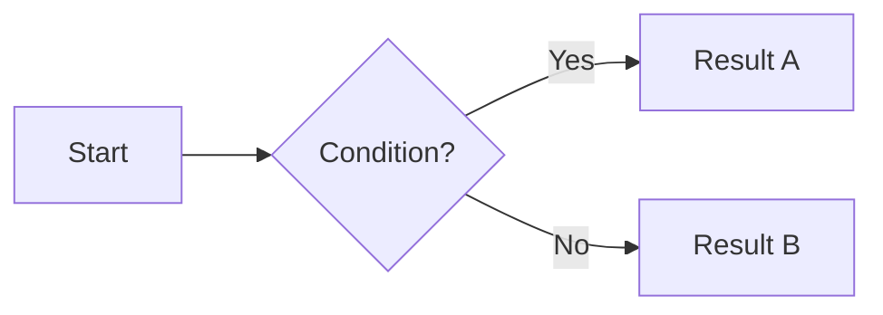

# Starlight Starter Kit: Tailwind + Mermaid


Documentation template powered by [Astro Starlight](https://starlight.astro.build/) with built-in support for **Tailwind CSS v4** and **Mermaid** diagrams.

>  [Versión en español disponible en README_ES.md](./README_ES.md)

##  Features

- **[Astro Starlight](https://starlight.astro.build/)**  Documentation framework with light/dark theme support, sidebar, search, and more.
- **[Tailwind CSS v4](https://tailwindcss.com/)**  CSS utilities via `@tailwindcss/vite`. Customize your design in `src/styles/global.css`.
- **[astro-mermaid](https://github.com/sherwinshen/astro-mermaid)**  Render Mermaid diagrams directly in Markdown/MDX files.
  - `forest` theme with `autoTheme` (adapts to light/dark mode automatically).
  - `basis` curve style for flowcharts.
  - Included icon packs: `logos` and `iconoir` (via Iconify).
- **[@mermaid-js/layout-elk](https://www.npmjs.com/package/@mermaid-js/layout-elk)**  ELK layout engine for complex diagrams.

##  Project Structure

```
.
 public/
 src/
    assets/
    content/
       docs/
           index.mdx
           guides/
           reference/
    styles/
       global.css
    content.config.ts
 astro.config.mjs
 package.json
 tsconfig.json
```

Starlight picks up `.md` and `.mdx` files inside `src/content/docs/`. Each file is exposed as a route based on its filename.

##  Using Mermaid

Write diagrams directly in your `.md` or `.mdx` files using `mermaid` code blocks:

````md

````

##  Commands

All commands are run from the root of the project:

| Command                | Action                                       |
| :--------------------- | :------------------------------------------- |
| `pnpm install`         | Install dependencies                         |
| `pnpm dev`             | Start local dev server at `localhost:4321`   |
| `pnpm build`           | Build the production site to `./dist/`       |
| `pnpm preview`         | Preview the build locally before deploying   |
| `pnpm astro ...`       | Run Astro CLI commands                       |
| `pnpm astro -- --help` | Get help using the Astro CLI                 |

##  Main Dependencies

| Package                       | Version | Role                             |
| :---------------------------- | :------ | :------------------------------- |
| `astro`                       | ^5.17   | Base framework                   |
| `@astrojs/starlight`          | ^0.37   | Documentation theme              |
| `@astrojs/starlight-tailwind` | ^4.0    | Starlight + Tailwind integration |
| `tailwindcss`                 | ^4.1    | CSS framework                    |
| `@tailwindcss/vite`           | ^4.1    | Vite plugin for Tailwind v4      |
| `astro-mermaid`               | ^1.3    | Mermaid diagram integration      |
| `mermaid`                     | ^11.12  | Diagram engine                   |
| `@mermaid-js/layout-elk`      | ^0.2    | ELK layout engine for Mermaid    |

##  Resources

- [Starlight documentation](https://starlight.astro.build/)
- [Astro documentation](https://docs.astro.build)
- [Tailwind CSS v4](https://tailwindcss.com/docs)
- [Mermaid syntax reference](https://mermaid.js.org/syntax/flowchart.html)
