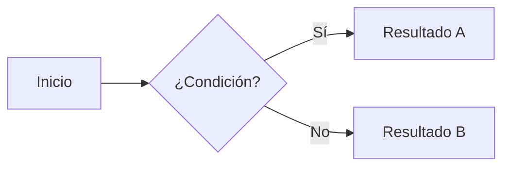

# Starlight Starter Kit: Tailwind + Mermaid

[](https://starlight.astro.build)

Template de documentación basado en [Astro Starlight](https://starlight.astro.build/) con soporte integrado para **Tailwind CSS v4** y **Mermaid** (diagramas).

##  Características

- **[Astro Starlight](https://starlight.astro.build/)**  Framework de documentación con soporte para temas claros/oscuros, barra lateral, búsqueda y más.
- **[Tailwind CSS v4](https://tailwindcss.com/)**  Utilidades CSS via `@tailwindcss/vite`. Personaliza el diseño en `src/styles/global.css`.
- **[astro-mermaid](https://github.com/sherwinshen/astro-mermaid)**  Renderizado de diagramas Mermaid directamente en Markdown/MDX.
  - Tema `forest` con `autoTheme` (se adapta al modo claro/oscuro).
  - Curvas de estilo `basis` en flowcharts.
  - Icon packs incluidos: `logos` e `iconoir` (via Iconify).
- **[@mermaid-js/layout-elk](https://www.npmjs.com/package/@mermaid-js/layout-elk)**  Motor de layout ELK para diagramas complejos.

##  Estructura del proyecto

```
 public/
 src/
    assets/
    content/
       docs/
           index.mdx
           guides/
           reference/
    styles/
       global.css
    content.config.ts
 astro.config.mjs
 package.json
 tsconfig.json
```

Starlight detecta archivos `.md` y `.mdx` dentro de `src/content/docs/`. Cada archivo se expone como una ruta basada en su nombre.

##  Uso de Mermaid

Escribe diagramas directamente en tus archivos `.md` o `.mdx` con bloques de código `mermaid`:

````md

````

##  Comandos

Todos los comandos se ejecutan desde la raíz del proyecto:

| Comando                | Acción                                             |
| :--------------------- | :------------------------------------------------- |
| `pnpm install`         | Instala las dependencias                           |
| `pnpm dev`             | Inicia el servidor local en `localhost:4321`       |
| `pnpm build`           | Genera el sitio de producción en `./dist/`         |
| `pnpm preview`         | Previsualiza el build antes de desplegar           |

##  Dependencias principales

| Paquete                      | Versión | Rol                              |
| :--------------------------- | :------ | :------------------------------- |
| `astro`                      | ^5.17   | Framework base                   |
| `@astrojs/starlight`         | ^0.37   | Tema de documentación            |
| `@astrojs/starlight-tailwind` | ^4.0   | Integración Starlight + Tailwind |
| `tailwindcss`                | ^4.1    | Framework CSS                    |
| `@tailwindcss/vite`          | ^4.1    | Plugin Vite para Tailwind v4     |
| `astro-mermaid`              | ^1.3    | Integración de diagramas Mermaid |
| `mermaid`                    | ^11.12  | Motor de diagramas               |
| `@mermaid-js/layout-elk`     | ^0.2    | Layout ELK para Mermaid          |

##  Recursos

- [Documentación de Starlight](https://starlight.astro.build/)
- [Documentación de Astro](https://docs.astro.build)
- [Tailwind CSS v4](https://tailwindcss.com/docs)
- [Sintaxis de Mermaid](https://mermaid.js.org/syntax/flowchart.html)
- [Astro Mermaid Plugin](https://github.com/joesaby/astro-mermaid)
