# starmaid-template


Template de documentación basado en [Astro Starlight](https://starlight.astro.build/) con soporte integrado para **Tailwind CSS v4** y **Mermaid** (diagramas).

> 🇬🇧 [English version available in README.md](./README.md)

## ✨ Características

- **[Astro Starlight](https://starlight.astro.build/)** — Framework de documentación con soporte para temas claros/oscuros, barra lateral, búsqueda y más.
- **[Tailwind CSS v4](https://tailwindcss.com/)** — Utilidades CSS via `@tailwindcss/vite`. Personaliza el diseño en `src/styles/global.css`.
- **[astro-mermaid](https://github.com/sherwinshen/astro-mermaid)** — Renderizado de diagramas Mermaid directamente en Markdown/MDX.
  - Tema `forest` con `autoTheme` (se adapta al modo claro/oscuro).
  - Curvas de estilo `basis` en flowcharts.
  - Icon packs incluidos: `logos` e `iconoir` (via Iconify).
- **[@mermaid-js/layout-elk](https://www.npmjs.com/package/@mermaid-js/layout-elk)** — Motor de layout ELK para diagramas complejos.

## 🚀 Estructura del proyecto

```
.
├── public/
├── src/
│   ├── assets/
│   ├── content/
│   │   └── docs/
│   │       ├── index.mdx
│   │       ├── guides/
│   │       └── reference/
│   ├── styles/
│   │   └── global.css
│   └── content.config.ts
├── astro.config.mjs
├── package.json
└── tsconfig.json
```

Starlight detecta archivos `.md` y `.mdx` dentro de `src/content/docs/`. Cada archivo se expone como una ruta basada en su nombre.

## 🧩 Uso de Mermaid

Escribe diagramas directamente en tus archivos `.md` o `.mdx` con bloques de código `mermaid`:

````md

```mermaid
flowchart LR
    A[Inicio] --> B{¿Condición?}
    B -- Sí --> C[Resultado A]
    B -- No --> D[Resultado B]
```

````

## 🧞 Comandos

Todos los comandos se ejecutan desde la raíz del proyecto:

| Comando                | Acción                                             |
| :--------------------- | :------------------------------------------------- |
| `pnpm install`         | Instala las dependencias                           |
| `pnpm dev`             | Inicia el servidor local en `localhost:4321`       |
| `pnpm build`           | Genera el sitio de producción en `./dist/`         |
| `pnpm preview`         | Previsualiza el build antes de desplegar           |
| `pnpm astro ...`       | Ejecuta comandos del CLI de Astro                  |
| `pnpm astro -- --help` | Ayuda del CLI de Astro                             |

## 📦 Dependencias principales

| Paquete                       | Versión | Rol                              |
| :---------------------------- | :------ | :------------------------------- |
| `astro`                       | ^5.17   | Framework base                   |
| `@astrojs/starlight`          | ^0.37   | Tema de documentación            |
| `@astrojs/starlight-tailwind` | ^4.0    | Integración Starlight + Tailwind |
| `tailwindcss`                 | ^4.1    | Framework CSS                    |
| `@tailwindcss/vite`           | ^4.1    | Plugin Vite para Tailwind v4     |
| `astro-mermaid`               | ^1.3    | Integración de diagramas Mermaid |
| `mermaid`                     | ^11.12  | Motor de diagramas               |
| `@mermaid-js/layout-elk`      | ^0.2    | Layout ELK para Mermaid          |

## 👀 Recursos

- [Documentación de Starlight](https://starlight.astro.build/)
- [Documentación de Astro](https://docs.astro.build)
- [Tailwind CSS v4](https://tailwindcss.com/docs)
- [Sintaxis de Mermaid](https://mermaid.js.org/syntax/flowchart.html)
